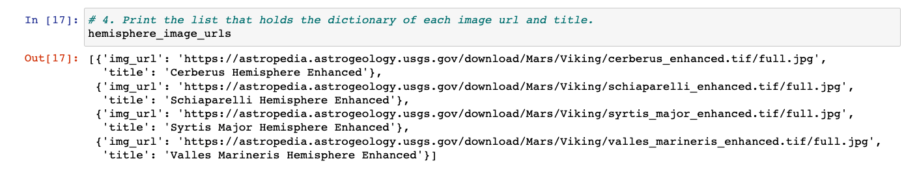
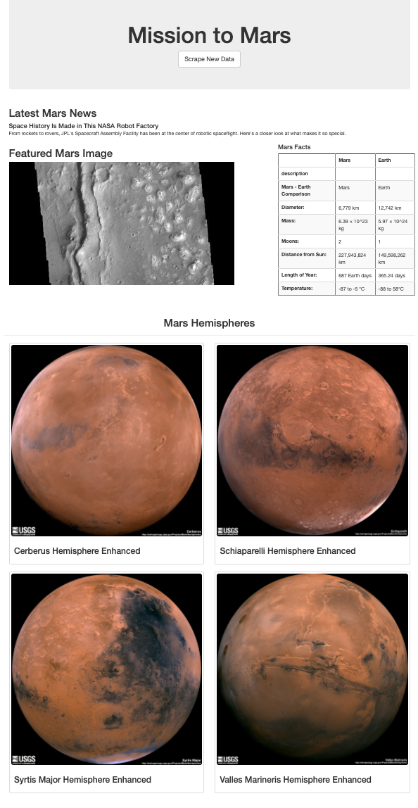
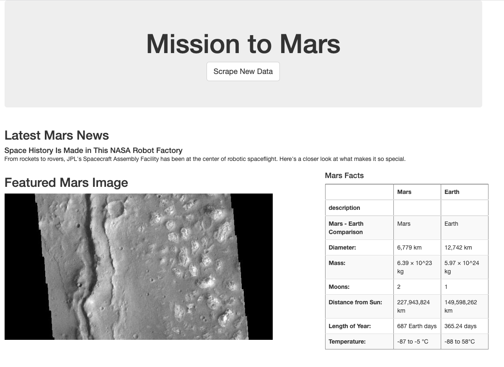
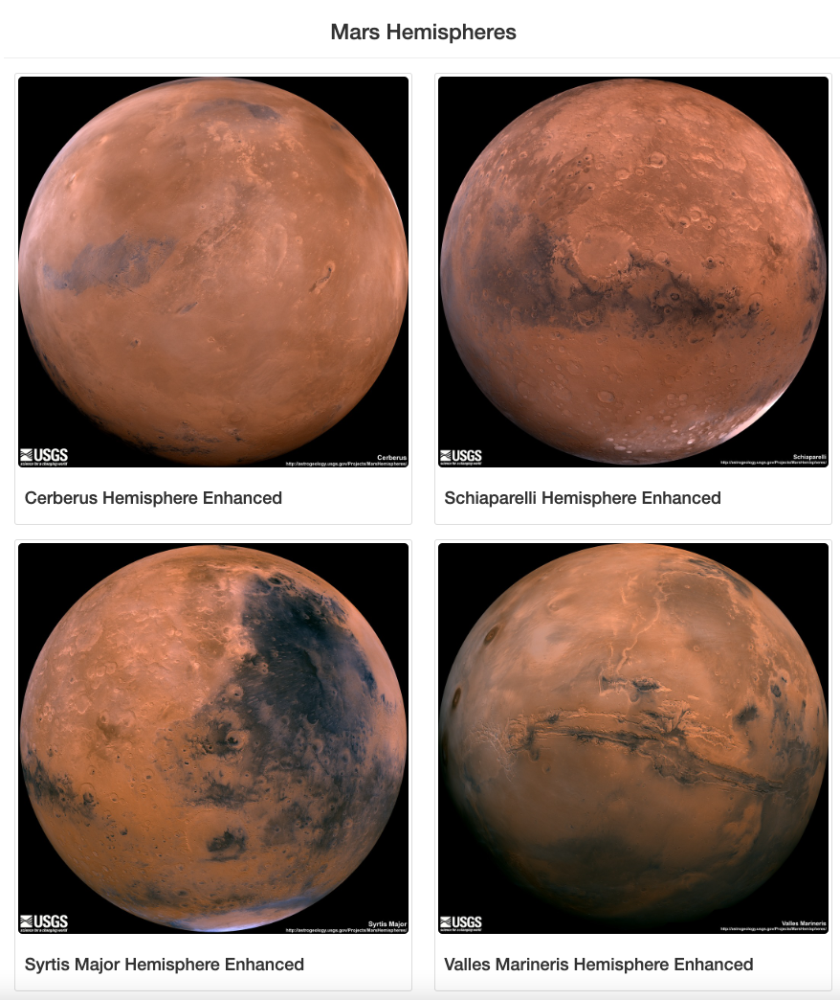

# Mission-to-Mars

## Overview
The purpose of this project was to centralize the latest news and information about Mars in an interactive and automated web browser that could be updated with a click of a button. To do so, BeautifulSoup and Splinter were utilized to navigate through web pages, locate desired data, parse and extract the data and store it in a Mongo database. Then HTML and Bootstrap was used to display it to the browser and optimize the layout.

## Resources
  * Python
  * Jupyter Notebook
  * Splinter
  * Beautiful Soup
  * Flask
  * MongoDB
  * HTML
  * Bootstrap
  * VS Code
  * Google Chrome DevTools

# Results
To centralize the data in an interactive web page, the following milestones were completed. First, code was written to retrieve the full-resolution image URL string and title for each hemisphere image.

Next, the Jupyter Notebook code was downloaded into a .py file for further iteration. Code was added to update the Mongo database to contain the full-resolution image URL and title for each hemisphere image An index.html file was created to contain code that would display the full-resolution image URL and title for each hemisphere image on the web app. Code was also added to further facilitate scraping after clicking a button. After the scraping would be completed, the web app would then contain all the information and the full-resolution images and titles for the four hemisphere images. Bootstrap 3 components were also added to the scraping button as well as the Mars Hemisphere images.

Full Page:

Top of Page:

Hemisphere Section:

